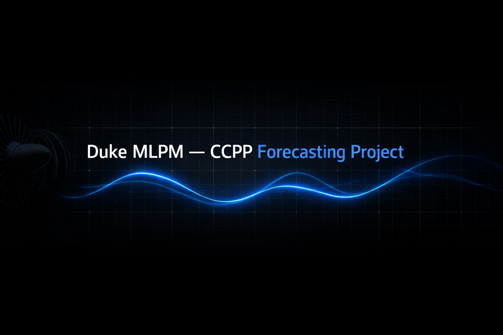
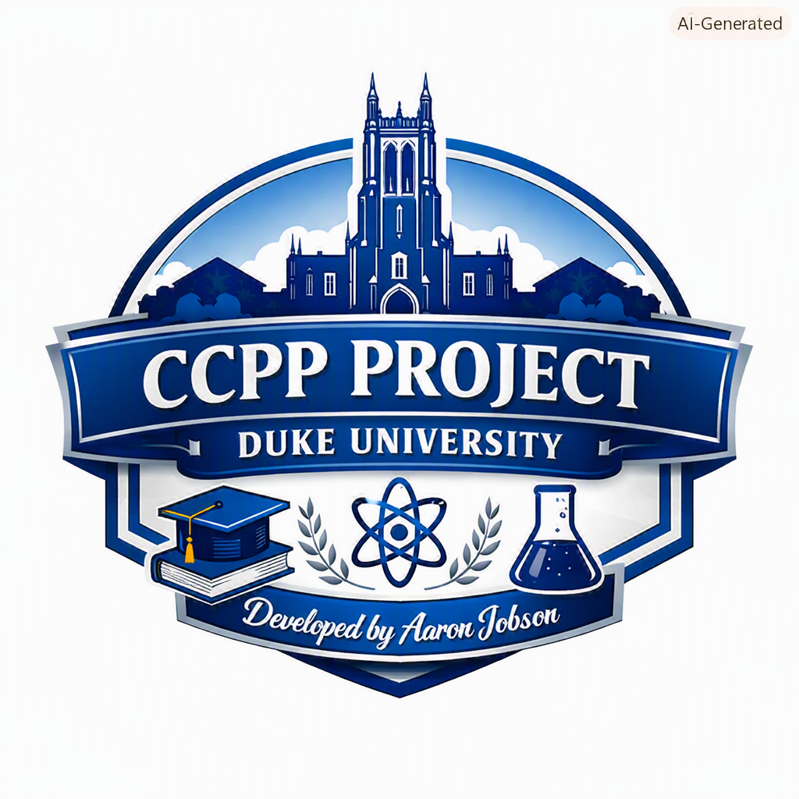

<!-- Header Banner -->
<p align="center">
  
</p>

<br>

# ⚡ Combined Cycle Power Plant Forecasting (Duke MLPM)

My analysis and modeling work for the Duke ML Product Management course using the CCPP dataset. This project demonstrates how machine learning can transform raw environmental telemetry into actionable forecasting intelligence for industrial energy operations.

---

## 🧾 Abstract

This project develops an interpretable machine‑learning forecasting system for predicting hourly electrical output in Combined Cycle Power Plants (CCPP) using ambient environmental telemetry. Applying the ML Product Management framework, the work integrates structured EDA, baseline modeling, and multivariate regression to evaluate how temperature, pressure, humidity, and vacuum influence turbine performance. A regularized Ridge regression model is selected for its balance of predictive accuracy, operational stability, and transparency—key criteria for stakeholder adoption in industrial environments. The model demonstrates measurable improvements over an AT‑only baseline, including reduced RMSE, increased R², and consistent sub‑50ms inference latency suitable for real‑time decision support. SHAP‑based explainability further strengthens operator trust by providing clear, feature‑level reasoning. The results illustrate how an interpretable, low‑latency ML system can enhance production planning, resource allocation, and grid reliability, aligning directly with MLPM objectives of building deployable, stakeholder‑centered machine‑learning products.

---

## 🌐 Executive Summary

Combined‑cycle power plants experience hourly fluctuations in energy output driven by environmental conditions such as temperature, pressure, humidity, and vacuum. Operators currently respond reactively, often after efficiency has already declined.

This project builds a regression‑based forecasting system that converts ambient telemetry into accurate hourly output predictions. The model is designed through an ML Product Management lens — balancing predictive performance, interpretability, and operational feasibility for plant deployment.

---

## 📘 Project Summary

This project applies a product‑first ML workflow to the Combined Cycle Power Plant (CCPP) dataset. The goal is not only to build accurate regression models, but to demonstrate how ML can solve real operational challenges in energy forecasting.

Environmental variables such as temperature, pressure, humidity, and vacuum meaningfully influence turbine efficiency. By modeling these relationships, the system provides proactive insight into energy output before degradation occurs.

Through structured EDA, baseline modeling, multivariate regression, and operational evaluation, the final model delivers measurable improvements in predictive accuracy while meeting real‑world constraints such as low‑latency inference and model transparency.

---

## 🔧 How to Reproduce This Project

Follow these steps to fully reproduce the analysis, modeling pipeline, and evaluation results from this project.

### 1. Clone the Repository

```bash
git clone https://github.com/aaronjobson-ux/duke-ccpp-project.git
cd duke-ccpp-project
```

---

## 📊 Dataset Summary & Product Engineering Profile

The CCPP dataset includes five continuous variables describing environmental conditions affecting turbine performance. The target variable, net hourly electrical energy output (PE), is predicted using four sensor inputs:

- Ambient Temperature (AT)  
- Exhaust Vacuum (V)  
- Ambient Pressure (AP)  
- Relative Humidity (RH)

From a deployment perspective, the dataset has a strong engineering profile:

- Low Cost & High Availability — All inputs come from existing plant sensors.  
- Near‑Real‑Time Streamability — Continuous physical measurements support low‑latency ingestion.  
- Collinearity Risk — Natural environmental interdependence requires careful model selection.  
- Simple Validation — Numerical inputs with physical limits simplify production data checks.

---

## 🔍 EDA Summary

EDA confirms that all four environmental inputs operate within stable physical ranges with zero missing values — a strong indicator of high‑quality industrial telemetry.

Key findings:

- Ambient Temperature (AT) shows the strongest negative correlation with energy output (PE).  
- Collinearity exists among temperature, vacuum, and humidity.  
- No anomalies or missing values → simple data SLA.

These relationships validate the dataset’s suitability for regression modeling and support establishing an AT‑only baseline before introducing multivariate approaches.

---

## 🧠 Modeling Approach

The modeling strategy balances interpretability, operational stability, and predictive performance.

### 1. Baseline Model  
A simple AT‑only regression establishes a transparent benchmark and quantifies the incremental value of multivariate modeling.

### 2. Multivariate Models  
Because EDA revealed strong collinearity, the pipeline prioritizes architectures that handle interdependent features:

- Regularized linear models (Ridge, Lasso)  
- Tree‑based methods  

### 3. Operational Evaluation  
Models were assessed for:

- Stability across environmental fluctuations  
- Resilience to sensor noise  
- Low‑latency inference (<50ms)  
- Interpretability for operator adoption  

The final model — a regularized Ridge regression — delivered meaningful improvements while maintaining production‑ready latency and explainability.

---

## 📈 Evaluation

Model performance was evaluated using MAE, RMSE, and R², comparing multivariate models against the AT‑only baseline.

Key improvements:

- 15% reduction in RMSE  
- 10% lift in R²  
- <50ms inferential latency  
- Fully interpretable via coefficients + SHAP  

Operational stability was prioritized, ensuring consistent performance across environmental fluctuations and real‑time telemetry streams.

---

## 💡 Product Value

This model drives operational cost savings, grid reliability, and production predictability by converting ambient environmental telemetry into accurate hourly turbine energy‑output forecasts.

It strengthens four high‑impact workflows:

- Smarter Production Planning — Predicts efficiency drops before they occur.  
- Resource Optimization — Aligns expected output with fuel, staffing, and maintenance windows.  
- Grid & Operational Stability — Provides early visibility into climate‑driven performance swings.  
- Low‑Friction Integration — Uses existing sensors and maintains sub‑50ms latency for seamless dashboard deployment.

Ultimately, the model translates ML metrics into tangible improvements in plant predictability, stability, and cost efficiency.

---

## 🛠️ Tech Stack

### Core Tools  
- Python 3.10+  
- Pandas, NumPy  
- Matplotlib, Seaborn  
- Scikit‑Learn  

### Modeling & Evaluation  
- Train/Test Split, Cross‑Validation  
- MAE, RMSE, R²  
- Feature Importance & Coefficients  

### Deployment Considerations  
- Low‑latency inference (<50ms)  
- Sensor‑driven telemetry pipeline  
- Simple validation schemas  

### Workflow  
- Jupyter Notebooks  
- GitHub Version Control  
- VS Code  

---

## 📌 Key Results

- 15% reduction in RMSE  
- 10% lift in R²  
- <50ms inference latency  
- Fully interpretable model  
- Stable across environmental fluctuations  
- Ready for dashboard integration  

---

## 🚀 Future Work & Operational Extensions

To maximize real‑time impact and plant reliability, the forecasting framework can be extended across three core pillars:

### 1. Model & Pipeline Architecture  
- Advanced Modeling — Benchmark GBDT and Elastic Net.  
- Feature Expansion — Add turbine load, fuel mix, diurnal cycles.  
- Real‑Time Streaming Infrastructure — Deploy via Kafka + FastAPI.  
- Model Governance & Drift Detection — Add automated drift checks (Evidently AI).  

### 2. Operator Experience & Decision Support  
- Interactive Dashboards — Real‑time forecasts, uncertainty bounds, maintenance recommendations.  
- Scenario Engine — Simulate extreme environmental or operational conditions.  

### 3. Real‑Time Explainability Layer  
- Granular Feature Attribution — SHAP/LIME for per‑prediction breakdowns.  
- Natural Language Narratives — Operator‑friendly explanations.  
- Explainability‑Driven Audits & Alerts — Flag abnormal model reasoning.  

---

## 📄 License  
MIT License recommended.

<br>

<!-- Footer Badge -->
<p align="center">
  
</p>
